# School District Analysis
## 1 Overview of Project

This project was the fourth challenge in the Carleton University Business Analytics and Data Visualization Boot Camp.  Module 4 of the boot camp was intended to help us, through the use of Pandas, Anaconda &amp; Jupyter, use Python to learn the basics of the Pandas library.  The project involved the use of an existing Jupyter Notebook which we then updated with the school data that had previously been prepared for the school board.

## 2  Approach

It had been reported by the school board that the file shows evidence of academic dishonesty; specifically, reading and math grades for Thomas High School ninth graders appears to have been altered.  Our task was to set the erroneous data aside and recalculate the outcomes.

### 2.1 Identifying the Data that Needs to be Corrected

The python code shown in figure 1 was used to isolate the data that was to be removed.

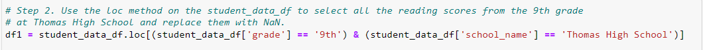
**Figure 1 - Retrieve THS 9th grade**

The first 10 rows of the identified data, grade 9 results for Thomas High School,  are shown in Table 1 below.

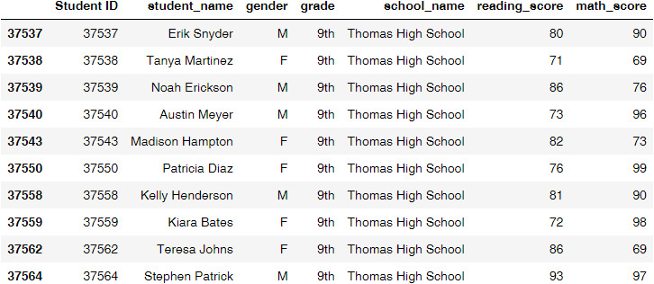
**Table 1 - THS 9th Grade Selected**

### 2.2 Removing the Erroneous data

The python code in figure 2 below shows the selected data being replaced using a numpy call np.nan that inserts NaN "Not a Number"  in place of the existing grades.  References to these NaNs will now be used to identify information that should not be used in the analysis.

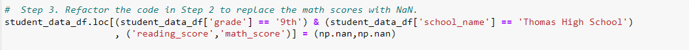
**Figure 2 - Replace R&W with NaN**

Using loc method the erroneous data for Thomas High School was then replaced, as can be seen in tables 2 below.

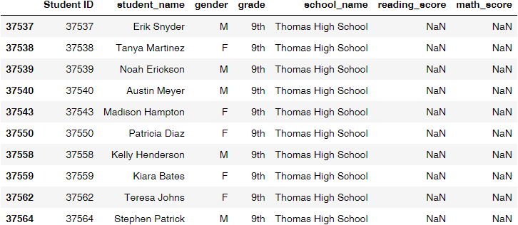
**Table 2 - 9th Grade Replaced**

### 2.3 Revaluating the Results

Before moving on with recalculating the results we need to confirm that the information in table 3 was as appears below.

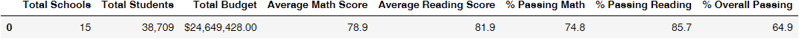
**Table 3 - District Summary**

It was also necessary to confirm that data for Thomas High School was in need of recalculation, see table 4 below.

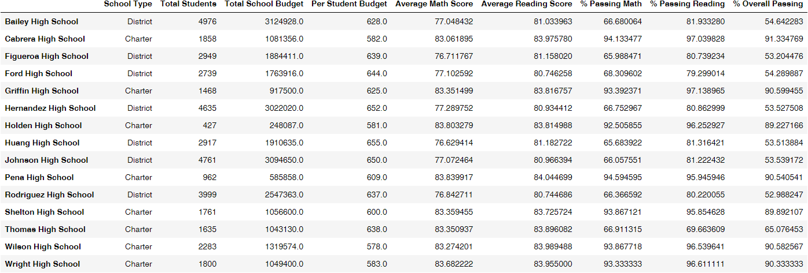
**Table 4 - School Summary Before**

## 3 Recalculated Results

The numerical values for the percentage of students passing, math, reading and overall for Thomas High School were then added to the data frame using the loc method for replacement as in section 2.2 of this report.  The school summary is presented in table 5 below, you will note a substantial improvement in the outcomes for Thomas High School.

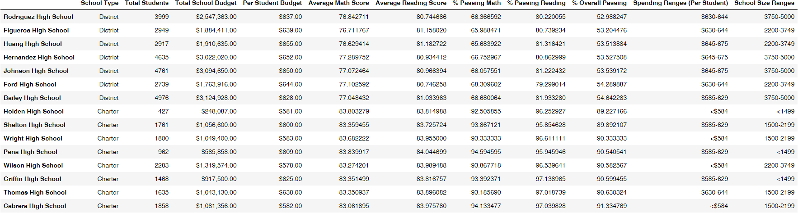
**Table 5 - School Summary After**

### 3.1 Overall Review of School Performance 

In table 6 below you will see that the top performing schools now include Thomas High School.

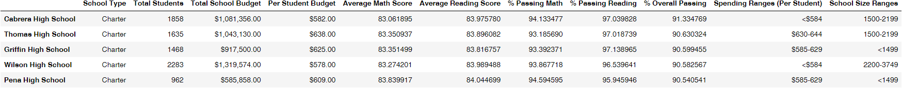
**Table 6 - Top 5 Schools**

Below in table 7 you we have listed the bottom performing school for this school board.  Further analysis is presented later in this report which may be helpful in the identification of opportunities for school improvement.

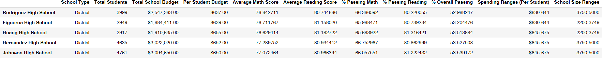
**Table 7 - Bottom 5 Schools**

The performance by grade level  for math is presented in table 8 below, you will notice that NaN has been entered for the Thomas High School grade 9 math results.

### 3.2 Review by Grade Level

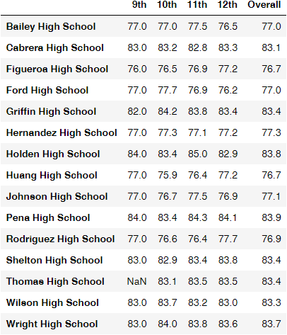
**Table 8 - Math Scores by Grade**

The performance by grade level  for reading is presented in table 9 below, you will notice that NaN has been entered for the Thomas High School grade 9 reading results.

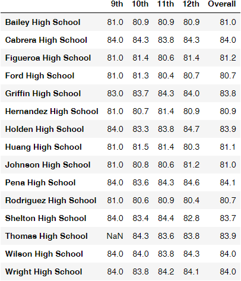
**Table 9 - Reading Scores by Grade**

### 3.3 Review by Categorization

Continuing with the analysis, we were asked to look at a few specific groupings of schools for investigation of contributing factors.

The first grouping of math and reading results were by spending range per student.  The groups were constructed so that similar numbers of schools were represented in each bin, the results are shown in table 10 below.

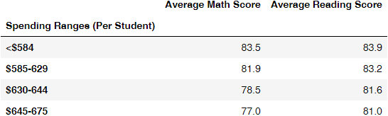
**Table 10 - Scores by School Spending**

An analysis was also conducted on groups consisting of similar size schools.   Again, the bin sizes were adjusted so that the sample size in each range consisted of a similar number of schools.  The results for these groups are presented in table 11 below.

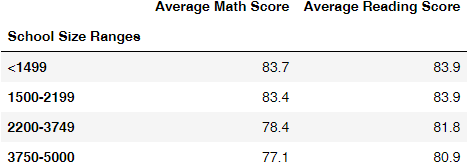
**Table 11 - Scores by School Size**

The last category that was investigated was a grouping by school type.  The outcomes for the charter and district school types are shown in table 12 below.

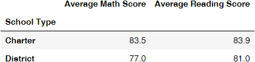
**Table 12 - Scores by School Type**

### 3.4 Summary of Outcomes

As can be seen in the results above, removal of the grade 9 data for Thomas High School had dramatic results, as could be expected for Thomas High School.  

- The percentage passing math increased substantially
- The percentage passing reading also showed substantial improvement
- As a result the overall passing percentage also showed major improvement
- Last, but definitely not least, Thomas High School has now been appropriately reported as one of the highest performing schools in the board
